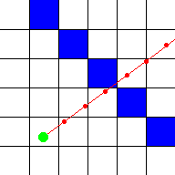
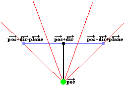
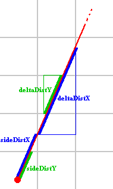

# Lode's Computer Graphics Tutorial Lode的计算机图形教程
# Raycasting 射线投射
## Introduction 引言
Raycasting is a rendering technique to create a 3D perspective in a 2D map. Back when computers were slower it wasn't possible to run real 3D engines in realtime, and raycasting was the first solution. Raycasting can go very fast, because only a calculation has to be done for every vertical line of the screen. The most well known game that used this technique, is of course Wolfenstein 3D.

射线投射是一种在2D平面上生成3D透视效果的渲染技术，以前的计算机运算速度比较慢，无法实时运行真正的3D引擎，而射线投射成了第一个解决办法。射线投射能够运行得很快，因为只需要对屏幕上的每一条竖线进行计算。在使用这项技术的游戏中，最出名的当属于 **《德军总部3D(Wolfenstein 3D)》。**


The raycasting engine of Wolfenstein 3D was very limited, allowing it to run on a even a 286 computer: all the walls have the same height and are orthogonal squares on a 2D grid, as can be seen in this screenshot from a mapeditor for Wolf3D:

《德军总部3D》的射线投射引擎非常有限，这足以让它能够运行在一台286计算机上：从这张《德军总部3D》地图编辑器的截图上可以看出来，所有的墙壁都是相同的高度，并且在一个2D网格上看都是正交正方形。


Things like stairs, jumping or height differences are impossible to make with this engine. Later games such as Doom and Duke Nukem 3D also used raycasting, but much more advanced engines that allowed sloped walls, different heights, textured floors and ceilings, transparent walls, etc... The sprites (enemies, objects and goodies) are 2D images, but sprites aren't discussed in this tutorial for now.

像楼梯、跳跃或高度差这样的事情是不可能用这个引擎实现的。后来的游戏，如《毁灭战士》和《Duke Nukem 3D》也使用了光线投射，但更先进的引擎允许倾斜的墙壁、不同的高度、有纹理的地板和天花板、透明的墙壁等......精灵（敌人、物体和好东西）是 2D 图像，但本教程暂时不讨论精灵。

Raycasting is not the same as raytracing! Raycasting is a fast semi-3D technique that works in realtime even on 4MHz graphical calculators, while raytracing is a realistic rendering technique that supports reflections and shadows in true 3D scenes, and only recently computers became fast enough to do it in realtime for reasonably high resolutions and complex scenes.

光线投射和光线追踪是不一样的！光线投射是一种快速的伪3D 技术，即使在 4MHz 图形计算器上也能实时工作，而光线追踪是一种逼真的渲染技术，支持真实 3D 场景中的反射和阴影，如今计算机变得足够快，可以在相当高的分辨率和复杂的场景中实现实时的光线追踪。

The code of the untextured and textured raycasters is given in this document completely, but it's quite long, you can also download the code instead:

本文档中完整给出了无纹理和纹理光线投射器的代码，但很长，您也可以下载代码：

## The Basic Idea 基本想法
The basic idea of raycasting is as follows: the map is a 2D square grid, and each square can either be 0 (= no wall), or a positive value (= a wall with a certain color or texture).

光线投射的基本思想如下：地图是一个 2D 正方形网格，每个正方形可以是 0（= 没有墙），也可以是正值（= 具有某种颜色或纹理的墙）。

For every x of the screen (i.e. for every vertical stripe of the screen), send out a ray that starts at the player location and with a direction that depends on both the player's looking direction, and the x-coordinate of the screen. Then, let this ray move forward on the 2D map, until it hits a map square that is a wall. If it hit a wall, calculate the distance of this hit point to the player, and use this distance to calculate how high this wall has to be drawn on the screen: the further away the wall, the smaller it's on screen, and the closer, the higher it appears to be. These are all 2D calculations. This image shows a top down overview of two such rays (red) that start at the player (green dot) and hit blue walls:

对于屏幕的每个 x（即屏幕的每个垂直条纹），发送一条从玩家位置开始的光线，其方向取决于玩家的注视方向和屏幕的 x 坐标。然后，让这条光线在 2D 地图上向前移动，直到它碰到一堵墙的地图方块。如果它撞到墙上，计算这个碰撞点到玩家的距离，并用这个距离来计算这堵墙必须在屏幕上画多高：墙越远，它在屏幕上越小，越近，它看起来越高。这些都是 2D 计算。这张图片显示了两条这样的光线（红色）的自上而下的概述，它们从玩家（绿点）开始并击中蓝色墙壁：


To find the first wall that a ray encounters on its way, you have to let it start at the player's position, and then all the time, check whether or not the ray is inside a wall. If it's inside a wall (hit), then the loop can stop, calculate the distance, and draw the wall with the correct height. If the ray position is not in a wall, you have to trace it further: add a certain value to its position, in the direction of the direction of this ray, and for this new position, again check if it's inside a wall or not. Keep doing this until finally a wall is hit.

要找到光线在途中遇到的第一堵墙，你必须让它从玩家的位置开始，然后一直检查光线是否在墙内。如果它在墙内（碰撞），那么循环可以停止，计算距离，并以正确的高度绘制墙。如果光线位置不在墙上，则必须进一步跟踪它：在该光线方向的方向上为其位置添加某个值，对于这个新位置，再次检查它是否在墙内。继续这样做，直到最后撞到墙上。

A human can immediatly see where the ray hits the wall, but it's impossible to find which square the ray hits immediatly with a single formula, because a computer can only check a finite number of positions on the ray. Many raycasters add a constant value to the ray each step, but then there's a chance that it may miss a wall! For example, with this red ray, its position was checked at every red spot:

人可以立即看到光线碰撞墙壁的位置，但不可能用一个公式立即找到光线击中哪个方格，因为计算机只能检查光线上有限数量的位置。许多光线投射器每一步都会为光线增加一个常量值，但这样可能会错过一堵墙！以这条红色射线为例，在每个红点处检查其位置：



As you can see, the ray goes straight through the blue wall, but the computer didn't detect this, because it only checked at the positions with the red dots. The more positions you check, the smaller the chance that the computer won't detect a wall, but the more calculations are needed. Here the step distance was halved, so now he detects that the ray went through a wall, though the position isn't completely correct:

正如你所看到的，光线直接穿过蓝色的墙壁，但计算机没有检测到这一点，因为它只检查了红点的位置。你检查的位置越多，计算机无法检测到墙壁的可能性就越小，但需要的计算就越多。在这里，步距减半，所以现在他检测到光线穿过了一堵墙，尽管位置并不完全正确：


For infinite precision with this method, an infinitely small step size, and thus an infinite number of calculations would be needed! That's pretty bad, but luckily, there's a better method that requires only very few calculations and yet will detect every wall: the idea is to check at every side of a wall the ray will encounter. We give each square width 1, so each side of a wall is an integer value and the places in between have a value after the point. Now the step size isn't constant, it depends on the distance to the next side:

为了获得这种方法的无限精度，步长无限小，因此需要无限数量的计算！这很糟糕，但幸运的是，有一种更好的方法，只需要很少的计算，就可以检测到每一面墙：这个想法是检查光线会遇到的墙的每一面。我们给每个平方宽度 1，所以墙的每一边都是一个整数值，中间的地方在点之后有一个值。现在步长不是恒定的，它取决于到下一侧的距离：


As you can see on the image above, the ray hits the wall exactly where we want it. In the way presented in this tutorial, an algorithm is used that's based on DDA or "Digital Differential Analysis". DDA is a fast algorithm typically used on square grids to find which squares a line hits (for example to draw a line on a screen, which is a grid of square pixels). So we can also use it to find which squares of the map our ray hits, and stop the algorithm once a square that is a wall is hit.

正如你在上图中看到的，光线正好照射到我们想要的地方。在本教程中介绍的方式中，使用基于 DDA 或“数字差分分析”的算法。DDA 是一种快速算法，通常用于方形网格，用于查找线击中的方块（例如，在屏幕上绘制一条线，这是方形像素的网格）。因此，我们也可以用它来查找我们的光线击中地图的哪些方块，并在击中作为墙的方块时停止算法。

Some raytracers work with Euclidean angles to represent the direction of the player and the rays, and determinate the Field Of View with another angle. I found however that it's much easier to work with vectors and a camera instead: the position of the player is always a vector (an x and a y coordinate), but now, we make the direction a vector as well: so the direction is now determinated by two values: the x and y coordinate of the direction. A direction vector can be seen as follows: if you draw a line in the direction the player looks, through the position of the player, then every point of the line is the sum of the position of the player, and a multiple of the direction vector. The length of a direction vector doesn't really matter, only its direction. Multiplying x and y by the same value changes the length but keeps the same direction.

一些光线追踪器使用欧几里得角来表示玩家和光线的方向，并用另一个角度确定视场。然而，我发现使用矢量和相机要容易得多：玩家的位置始终是一个矢量（一个 x 和一个 y 坐标），但现在，我们也将方向设为矢量：所以方向现在由两个值决定：方向的 x 和 y 坐标。方向向量可以看作如下：如果你在玩家看的方向上画一条线，通过玩家的位置，那么线的每个点都是玩家位置的总和，以及方向向量的倍数。方向向量的长度并不重要，重要的是它的方向。将 x 和 y 乘以相同的值会改变长度，但保持相同的方向。

This method with vectors also requires an extra vector, which is the camera plane vector. In a true 3D engine, there's also a camera plane, and there this plane is really a 3D plane so two vectors (u and v) are required to represent it. Raycasting happens in a 2D map however, so here the camera plane isn't really a plane, but a line, and is represented with a single vector. The camera plane should always be perpendicular on the direction vector. The camera plane represents the surface of the computer screen, while the direction vector is perpendicular on it and points inside the screen. The position of the player, which is a single point, is a point in front of the camera plane. A certain ray of a certain x-coordinate of the screen, is then the ray that starts at this player position, and goes through that position on the screen or thus the camera plane.

这种带有矢量的方法还需要一个额外的矢量，即相机平面矢量。在真正的 3D 引擎中，还有一个相机平面，这个平面实际上是一个 3D 平面，所以需要两个向量（u 和 v）来表示它。然而，光线投射发生在 2D 地图中，因此这里的相机平面实际上并不是一个平面，而是一条线，并用单个矢量表示。相机平面应始终垂直于方向矢量。相机平面表示计算机屏幕的表面，而方向矢量垂直于其并指向屏幕内部。玩家的位置是一个单点，是摄像机平面前面的一个点。然后，屏幕某个 x 坐标的某条光线就是从该玩家位置开始的光线，并穿过屏幕上的该位置或摄像机平面。



The image above represents such a 2D camera. The green spot is the position (vector "pos"). The black line, ending in the black spot, represents the direction vector (vector "dir"), so the position of the black dot is pos+dir. The blue line represents the full camera plane, the vector from the black dot to the right blue dot represents the vector "plane", so the position of the right blue point is pos+dir+plane, and the posistion of the left blue dot is pos+dir-plane (these are all vector additions).

上图代表了这样的 2D 相机。绿点是位置（向量“pos”）。以黑点结尾的黑线代表方向向量（向量“dir”），因此黑点的位置是pos+dir。蓝线代表整个相机平面，从黑点到右边蓝点的向量代表矢量“平面”，所以右边蓝点的位置是pos+dir+plane，左边蓝点的位置是pos+dir-plane（这些都是矢量加法）。

The red lines in the image are a few rays. The direction of these rays is easily calculated out of the camera: it's the sum of the direction vector of the camear, and a part of the plane vector of the camera: for example the third red ray on the image, goes through the right part of the camera plane at the point about 1/3th of its length. So the direction of this ray is dir + plane*1/3. This ray direction is the vector rayDir, and the X and Y component of this vector are then used by the DDA algorithm.

图像中的红线是几条射线。这些光线的方向很容易从相机中计算出来：它是凸轮的方向矢量和相机平面矢量的一部分之和：例如，图像上的第三条红色光线穿过相机平面的右侧，大约是其长度的 1/3。所以这条射线的方向是 dir + plane*1/3。该光线方向是矢量 rayDir，然后 DDA 算法使用该矢量的 X 和 Y 分量。

The two outer lines, are the left and right border of the screen, and the angle between those two lines is called the Field Of Vision or FOV. The FOV is determinated by the ratio of the length of the direction vector, and the length of the plane. Here are a few examples of different FOV's:

两条外线是屏幕的左右边框，这两条线之间的角度称为视野或 FOV。FOV 由方向矢量的长度与平面长度的比值决定。以下是不同 FOV 的几个示例：

If the direction vector and the camera plane vector have the same length, the FOV will be 90°:

如果方向矢量和相机平面矢量的长度相同，则 FOV 将为 90°：


If the direction vector is much longer than the camera plane, the FOV will be much smaller than 90°, and you'll have a very narrow vision. You'll see everything more detailed though and there will be less depth, so this is the same as zooming in:

如果方向矢量比相机平面长得多，则 FOV 将远小于 90°，并且你的视野会非常狭窄。不过，你会看到更详细的内容，并且深度会更小，所以这与放大的效果相同：


If the direction vector is shorter than the camera plane, the FOV will be larger than 90° (180° is the maximum, if the direction vector is close to 0), and you'll have a much wider vision, like zooming out:

如果方向矢量短于相机平面，则 FOV 将大于 90°（如果方向矢量接近 0，则最大为 180°），并且你将拥有更宽的视野，很像缩小的效果：


When the player rotates, the camera has to rotate, so both the direction vector and the plane vector have to be rotated. Then, the rays will all automaticly rotate as well.

当玩家旋转时，摄像机必须旋转，因此方向矢量和平面矢量都必须旋转。然后光线自然也跟着旋转。


To rotate a vector, multiply it with the rotation matrix

要旋转一个向量，将其与旋转矩阵相乘
```
[ cos(a) -sin(a) ]
[ sin(a)  cos(a) ]
```
If you don't know about vectors and matrices, try to find a tutorial with google, an appendix about those is planned for this tutorial later.

如果您不了解向量和矩阵，请尝试在 google 上查找教程，稍后将在本教程中提供有关这些内容的附录。

There's nothing that forbids you to use a camera plane that isn't perpendicular to the direction, but the result will look like a "skewed" world.

你不是非得使用垂直于方向的相机平面，（如果你使用一个不垂直于方向的相机平面）但结果会看起来像一个“倾斜”的世界。

## Untextured Raycaster 无纹理的光线投射
Download the source code here: raycaster_flat.cpp

To start with the basics, we'll begin with an untextured raycaster. This example also includes an fps counter (frames per second), and input keys with collision detection to move and rotate.

首先，我们将从无纹理的光线投射器开始。此示例还包括一个 fps 计数器（每秒帧数）和具有移动和旋转碰撞检测功能的输入键。

The map of the world is a 2D array, where each value represents a square. If the value is 0, that square represents an empty, walkthroughable square, and if the value is higher than 0, it represents a wall with  a certain color or texture. The map declared here is very small, only 24 by 24 squares, and is defined directly in the code. For a real game, like Wolfenstein 3D, you use a bigger map and load it from a file instead. All the zero's in the grid are empty space, so basicly you see a very big room, with a wall around it (the values 1), a small room inside it (the values 2), a few pilars (the values 3), and a corridor with a room (the values 4). Note that this code isn't inside any function yet, put it before the main function starts.

世界地图是一个 2D 数组，其中每个值代表一个正方形。如果值为 0，则该正方形表示一个空的、可遍历的正方形，如果该值大于 0，则表示具有特定颜色或纹理的墙。这里声明的地图非常小，只有 24 x 24 个正方形，并且直接在代码中定义。对于像《德军总部3D》这样的真实游戏，你使用更大的地图，然后从文件中加载它。网格中的所有零都是空白空间，所以基本上你会看到一个非常大的房间，周围有一堵墙（值 1），里面有一个小房间（值 2），几个柱子（值 3）和一个带房间的走廊（值 4）。请注意，此代码尚未包含在任何函数中，请将其放在 main 函数启动之前。

```C++
#define mapWidth 24
#define mapHeight 24
#define screenWidth 640
#define screenHeight 480

int worldMap[mapWidth][mapHeight]=
{
  {1,1,1,1,1,1,1,1,1,1,1,1,1,1,1,1,1,1,1,1,1,1,1,1},
  {1,0,0,0,0,0,0,0,0,0,0,0,0,0,0,0,0,0,0,0,0,0,0,1},
  {1,0,0,0,0,0,0,0,0,0,0,0,0,0,0,0,0,0,0,0,0,0,0,1},
  {1,0,0,0,0,0,0,0,0,0,0,0,0,0,0,0,0,0,0,0,0,0,0,1},
  {1,0,0,0,0,0,2,2,2,2,2,0,0,0,0,3,0,3,0,3,0,0,0,1},
  {1,0,0,0,0,0,2,0,0,0,2,0,0,0,0,0,0,0,0,0,0,0,0,1},
  {1,0,0,0,0,0,2,0,0,0,2,0,0,0,0,3,0,0,0,3,0,0,0,1},
  {1,0,0,0,0,0,2,0,0,0,2,0,0,0,0,0,0,0,0,0,0,0,0,1},
  {1,0,0,0,0,0,2,2,0,2,2,0,0,0,0,3,0,3,0,3,0,0,0,1},
  {1,0,0,0,0,0,0,0,0,0,0,0,0,0,0,0,0,0,0,0,0,0,0,1},
  {1,0,0,0,0,0,0,0,0,0,0,0,0,0,0,0,0,0,0,0,0,0,0,1},
  {1,0,0,0,0,0,0,0,0,0,0,0,0,0,0,0,0,0,0,0,0,0,0,1},
  {1,0,0,0,0,0,0,0,0,0,0,0,0,0,0,0,0,0,0,0,0,0,0,1},
  {1,0,0,0,0,0,0,0,0,0,0,0,0,0,0,0,0,0,0,0,0,0,0,1},
  {1,0,0,0,0,0,0,0,0,0,0,0,0,0,0,0,0,0,0,0,0,0,0,1},
  {1,0,0,0,0,0,0,0,0,0,0,0,0,0,0,0,0,0,0,0,0,0,0,1},
  {1,4,4,4,4,4,4,4,4,0,0,0,0,0,0,0,0,0,0,0,0,0,0,1},
  {1,4,0,4,0,0,0,0,4,0,0,0,0,0,0,0,0,0,0,0,0,0,0,1},
  {1,4,0,0,0,0,5,0,4,0,0,0,0,0,0,0,0,0,0,0,0,0,0,1},
  {1,4,0,4,0,0,0,0,4,0,0,0,0,0,0,0,0,0,0,0,0,0,0,1},
  {1,4,0,4,4,4,4,4,4,0,0,0,0,0,0,0,0,0,0,0,0,0,0,1},
  {1,4,0,0,0,0,0,0,0,0,0,0,0,0,0,0,0,0,0,0,0,0,0,1},
  {1,4,4,4,4,4,4,4,4,0,0,0,0,0,0,0,0,0,0,0,0,0,0,1},
  {1,1,1,1,1,1,1,1,1,1,1,1,1,1,1,1,1,1,1,1,1,1,1,1}
};
```

A first few variables are declared: posX and posY represent the position vector of the player, dirX and dirY represent the direction of the player, and planeX and planeY the camera plane of the player. Make sure the camera plane is perpendicular to the direction, but you can change the length of it. The ratio between the length of the direction and the camera plane determinates the FOV, here the direction vector is a bit longer than the camera plane, so the FOV will be smaller than 90° (more precisely, the FOV is 2 * atan(0.66/1.0)=66°, which is perfect for a first person shooter game). Later on when rotating around with the input keys, the values of dir and plane will be changed, but they'll always remain perpendicular and keep the same length.

声明了前几个变量：posX 和 posY 表示玩家的位置向量，dirX 和 dirY 表示玩家的方向，planeX 和 planeY 表示玩家的相机平面。确保相机平面垂直于方向，但您可以更改其长度。方向长度与摄像机平面的比值决定了视场，这里方向矢量比摄像机平面长一点，所以视场角会小于90°（更准确地说，视场角是2*atan（0.66/1.0）=66°，非常适合第一人称射击游戏）。稍后，当使用输入键旋转时，dir 和 plane 的值将发生变化，但它们将始终保持垂直并保持相同的长度。

The variables time and oldTime will be used to store the time of the current and the previous frame, the time difference between these two can be used to determinate how much you should move when a certain key is pressed (to move a constant speed no matter how long the calculation of the frames takes), and for the FPS counter.

变量 time 和 oldTime 将用于存储当前帧和上一帧的时间，这两者之间的时间差可用于确定按下某个键时应该移动多少（无论帧的计算需要多长时间，都可以移动恒定速度）， 以及 FPS 计数器。

```C++
int main(int /*argc*/, char */*argv*/[])
{
  double posX = 22, posY = 12;  //x and y start position
  double dirX = -1, dirY = 0; //initial direction vector
  double planeX = 0, planeY = 0.66; //the 2d raycaster version of camera plane

  double time = 0; //time of current frame
  double oldTime = 0; //time of previous frame
```

The rest of the main function starts now. First, the screen is created with a resolution of choice. If you pick a large resolution, like 1280*1024, the effect will go quite slow, not because the raycating algorithm is slow, but simply because uploading a whole screen from the CPU to the video card goes so slow.

接下来就是main函数的其余部分。首先，以选择的分辨率创建屏幕。如果选择较大的分辨率，例如 1280*1024，效果会很慢，不是因为光线投射算法很慢，而仅仅是因为将整个屏幕从 CPU 上传到显示器太慢了。

```C++
  screen(screenWidth, screenHeight, 0, "Raycaster");
```

After setting up the screen, the gameloop starts, this is the loop that draws a whole frame and reads the input every time.

设置好屏幕后，游戏循环就开始了，这个循环会绘制整一帧的画面并且实时读取输入。

```C++
  while(!done())
  {
```

Here starts the actual raycasting. The raycasting loop is a for loop that goes through every x, so there isn't a calculation for every pixel of the screen, but only for every vertical stripe, which isn't much at all! To begin the raycasting loop, some variables are delcared and calculated:

光线投射从这里正式开始运作了。光线投射循环是一个 for 循环，它遍历每个 x，所以无需对屏幕的每个像素进行计算，而只对每个垂直条纹进行计算，就这点计算量！为了开始光线投射的循环，需要对一些变量进行声明和计算：

The ray starts at the position of the player (posX, posY).

光线从玩家的位置`（posX、posY）`开始。

cameraX is the x-coordinate on the camera plane that the current x-coordinate of the screen represents, done this way so that the right side of the screen will get coordinate 1, the center of the screen gets coordinate 0, and the left side of the screen gets coordinate -1. Out of this, the direction of the ray can be calculated as was explained earlier: as the sum of the direction vector, and a part of the plane vector. This has to be done both for the x and y coordinate of the vector (since adding two vectors is adding their x-coordinates, and adding their y-coordinates).

`cameraX `是屏幕当前` x `坐标所代表的相机平面上的 `x `坐标，以这种方式完成，使屏幕右侧获得坐标` 1`，屏幕中心获得坐标` 0`，屏幕左侧获得坐标 `-1`。由此，射线的方向可以如前所述计算：作为方向矢量和平面矢量的一部分的总和。对于向量的` x `和` y `坐标，必须同时执行此操作（因为两个向量相加就是它们的 `x` 坐标相加，以及它们的` y `坐标相加）。

```C++
    for(int x = 0; x < w; x++)
    {
      //calculate ray position and direction
      double cameraX = 2 * x / double(w) - 1; //x-coordinate in camera space
      double rayDirX = dirX + planeX * cameraX;
      double rayDirY = dirY + planeY * cameraX;
```

In the next code piece, more variables are declared and calculated, these have relevance to the DDA algorithm:

在下一个代码段中，声明和计算了更多变量，这些变量与 DDA 算法相关：

mapX and mapY represent the current square of the map the ray is in. The ray position itself is a floating point number and contains both info about in which square of the map we are, and where in that square we are, but mapX and mapY are only the coordinates of that square.

`mapX` 和 `mapY` 表示光线所在地图的当前正方形。射线位置本身是一个浮点数，包含有关我们在地图的哪个方格中的信息，以及我们在该方格中的位置，但 `mapX` 和 `mapY` 只是该方块的坐标。

`sideDistX` and `sideDistY` are initially the distance the ray has to travel from its start position to the first x-side and the first y-side. Later in the code they will be incremented while steps are taken.

`sideDistX` 和 `sideDistY` 最初是光线从其起始位置到第一个 x 侧和第一个 y 侧的距离。在代码的后面，它们将在执行步骤时递增。

`deltaDistX` and `deltaDistY` are the distance the ray has to travel to go from 1 `x-side` to the next `x-side`, or from 1 `y-side` to the next `y-side`. The following image shows the initial `sideDistX`, `sideDistY` and `deltaDistX` and `deltaDistY`:

`deltaDistX` 和 `deltaDistY` 是光线从 1 个 `x` 侧到下一个 `x `侧或从 1 个 `y `侧到下一个 `y` 侧必须行进的距离。下图显示了初始 `sideDistX`、`sideDistY` 和 `deltaDistX` 以及 `deltaDistY`：



When deriving `deltaDistX` geometrically you get, with Pythagoras, the formulas below. For the blue triangle (`deltaDistX`), one side has length 1 (as it is exactly one cell) and the other has length `raydirY / raydirX` because it is exaclty the amount of units the ray goes in the y-direction when taking 1 step in the X-direction. For the green triangle (`deltaDistY`), the formula is similar.

当几何推导 `deltaDistX` 时，您可以使用毕达哥拉斯得到以下公式。对于蓝色三角形 （`deltaDistX`），一侧的长度为 1（因为它正好是一个单元格），另一侧的长度为 `raydirY / raydirX`，因为它恰好是光线在 y 方向上移动 1 步时沿 y 方向移动的单位数量。对于绿色三角形 （`deltaDistY`），公式类似。

```
deltaDistX = sqrt(1 + (rayDirY * rayDirY) / (rayDirX * rayDirX))
deltaDistY = sqrt(1 + (rayDirX * rayDirX) / (rayDirY * rayDirY))
```

But this can be simplified to:

不过这可以简化为：

```
deltaDistX = abs(|rayDir| / rayDirX)
deltaDistY = abs(|rayDir| / rayDirY)
```

Where |rayDir| is the length of the vector rayDirX, rayDirY (that is sqrt(rayDirX * rayDirX + rayDirY * rayDirY)): you can indeed verify that e.g. sqrt(1 + (rayDirY * rayDirY) / (rayDirX * rayDirX)) equals abs(sqrt(rayDirX * rayDirX + rayDirY * rayDirY) / rayDirX). However, we can use 1 instead of |rayDir|, because only the *ratio* between deltaDistX and deltaDistY matters for the DDA code that follows later below, so we get:

其中 `|rayDir|`是矢量 `(rayDirX, rayDirY)`的长度（即 `sqrt(rayDirX * rayDirX + rayDirY * rayDirY)`）：您确实可以验证例如 `sqrt(1 + (rayDirY * rayDirY) / (rayDirX * rayDirX))` 等于` abs(sqrt(rayDirX * rayDirX + rayDirY * rayDirY) / rayDirX)`。但是，我们可以使用 `1` 而不是 `|rayDir|`，因为只有 `deltaDistX` 和 `deltaDistY` 之间的 *`ratio`* 对下面后面的 DDA 代码很重要，因此我们得到：

```
deltaDistX = abs(1 / rayDirX)
deltaDistY = abs(1 / rayDirY)
```

Due to this, the `deltaDist` and `sideDist` values used in the code do not match the lengths shown in the picture above, but their relative sizes all still match.

因此，代码中使用的 `deltaDist` 和 `sideDist` 值与上图中所示的长度不匹配，但它们的相对大小仍然匹配。

[thanks to Artem for spotting this simplification]

[感谢 Artem 发现这种简化]

The variable perpWallDist will be used later to calculate the length of the ray.

变量 perpWallDist 稍后将用于计算光线的长度。

The DDA algorithm will always jump exactly one square each loop, either a square in the x-direction, or a square in the y-direction. If it has to go in the negative or positive x-direction, and the negative or positive y-direction will depend on the direction of the ray, and this fact will be stored in stepX and stepY. Those variables are always either -1 or +1.

DDA 算法将始终在每个循环中恰好跳出一个方块，要么是 x 方向的正方形，要么是 y 方向的正方形。如果它必须朝负或正 x 方向走，而负或正 y 方向将取决于光线的方向，这个事实将存储在 stepX 和 stepY 中。这些变量始终为 -1 或 +1。

Finally, hit is used to determinate whether or not the coming loop may be ended, and side will contain if an x-side or a y-side of a wall was hit. If an x-side was hit, side is set to 0, if an y-side was hit, side will be 1. By x-side and y-side, I mean the lines of the grid that are the borders between two squares.

最后，命中用于确定即将到来的循环是否可能结束，如果墙壁的 x 侧或 y 侧被击中，则 side 将包含。如果击中了 x 面，则 side 设置为 0，如果击中了 y 面，则 side 将为 1。我所说的 x 面和 y 面，是指网格的线，即两个正方形之间的边界。

```C++
      //which box of the map we're in
      int mapX = int(posX);
      int mapY = int(posY);

      //length of ray from current position to next x or y-side
      double sideDistX;
      double sideDistY;

       //length of ray from one x or y-side to next x or y-side
      double deltaDistX = (rayDirX == 0) ? 1e30 : std::abs(1 / rayDirX);
      double deltaDistY = (rayDirY == 0) ? 1e30 : std::abs(1 / rayDirY);
      double perpWallDist;

      //what direction to step in x or y-direction (either +1 or -1)
      int stepX;
      int stepY;

      int hit = 0; //was there a wall hit?
      int side; //was a NS or a EW wall hit?
```

NOTE: If rayDirX or rayDirY are 0, the division through zero is avoided by setting it to a very high value 1e30. If you are using a language such as C++, Java or JS, this is not actually needed, as it supports the IEEE 754 floating point standard, which gives the result Infinity, which works correctly in the code below. However, some other languages, such as Python, disallow division through zero, so the more generic code that works everywhere is given above. 1e30 is an arbitrarily chosen high enough number and can be set to Infinity if your programming language supports assiging that value.

注意：如果 rayDirX 或 rayDirY 为 0，则通过将其设置为非常高的值 1e30 来避免零的除法。如果您使用的是C++，Java或JS之类的语言，则实际上不需要这样做，因为它支持IEEE 754浮点标准，该标准给出的结果为Infinity，在下面的代码中可以正常工作。但是，其他一些语言，例如 Python，不允许通过零除法，因此上面给出了在任何地方都有效的更通用的代码。1e30 是任意选择的足够高的数字，如果您的编程语言支持同化该值，则可以将其设置为无穷大。

Now, before the actual DDA can start, first stepX, stepY, and the initial sideDistX and sideDistY still have to be calculated.

现在，在实际的 DDA 开始之前，仍然需要计算第一个 stepX、stepY 以及初始 sideDistX 和 sideDistY。

If the ray direction has a negative x-component, stepX is -1, if the ray direciton has a positive x-component it's +1. If the x-component is 0, it doesn't matter what value stepX has since it'll then be unused.
The same goes for the y-component.

如果射线方向具有负 x 分量，则 stepX 为 -1，如果光线方向具有正 x 分量，则为 +1。如果 x 分量为 0，则 stepX 的值无关紧要，因为它将未被使用。
y 分量也是如此。

If the ray direction has a negative x-component, sideDistX is the distance from the ray starting position to the first side to the left, if the ray direciton has a positive x-component the first side to the right is used instead.
The same goes for the y-component, but now with the first side above or below the position.
For these values, the integer value mapX is used and the real position subtracted from it, and 1.0 is added in some of the cases depending if the side to the left or right, of the top or the bottom is used. Then you get the perpendicular distance to this side, so multiply it with deltaDistX or deltaDistY to get the real Euclidean distance.

如果光线方向具有负 x 分量，则 sideDistX 是从光线起始位置到左侧第一侧的距离，如果光线方向具有正 x 分量，则使用右侧的第一侧。
y 分量也是如此，但现在第一侧位于该位置的上方或下方。
对于这些值，使用整数值 mapX 并从中减去实际位置，在某些情况下，根据 1.0 是使用顶部还是底部的左侧或右侧。然后你得到与这边的垂直距离，所以把它乘以 deltaDistX 或 deltaDistY 得到真正的欧几里得距离。

```C++
      //calculate step and initial sideDist
      if (rayDirX < 0)
      {
        stepX = -1;
        sideDistX = (posX - mapX) * deltaDistX;
      }
      else
      {
        stepX = 1;
        sideDistX = (mapX + 1.0 - posX) * deltaDistX;
      }
      if (rayDirY < 0)
      {
        stepY = -1;
        sideDistY = (posY - mapY) * deltaDistY;
      }
      else
      {
        stepY = 1;
        sideDistY = (mapY + 1.0 - posY) * deltaDistY;
      }
```

Now the actual DDA starts. It's a loop that increments the ray with 1 square every time, until a wall is hit. Each time, either it jumps a square in the x-direction (with stepX) or a square in the y-direction (with stepY), it always jumps 1 square at once. If the ray's direction would be the x-direction, the loop will only have to jump a square in the x-direction everytime, because the ray will never change its y-direction. If the ray is a bit sloped to the y-direction, then every so many jumps in the x-direction, the ray will have to jump one square in the y-direction. If the ray is exactly the y-direction, it never has to jump in the x-direction, etc...

现在，实际的 DDA 开始了。这是一个循环，每次增加 1 个方格的光线，直到撞到一堵墙。每次，无论是在 x 方向上跳一个正方形（用 stepX）还是在 y 方向上跳一个正方形（用 stepY），它总是一次跳 1 个正方形。如果光线的方向是 x 方向，则循环每次只需在 x 方向上跳跃一个正方形，因为光线永远不会改变其 y 方向。如果光线向 y 方向倾斜一点，那么在 x 方向上每跳跃这么多次，光线就必须在 y 方向上跳跃一个方格。如果光线正好是 y 方向，它就不必向 x 方向跳跃，等等......

sideDistX and sideDistY get incremented with deltaDistX with every jump in their direction, and mapX and mapY get incremented with stepX and stepY respectively.

sideDistX 和 sideDistY 随着 deltaDistX 的每次方向跳跃而递增，而 mapX 和 mapY 分别随着 stepX 和 stepY 的递增而递增。

When the ray has hit a wall, the loop ends, and then we'll know whether an x-side or y-side of a wall was hit in the variable "side", and what wall was hit with mapX and mapY. We won't know exactly where the wall was hit however, but that's not needed in this case because we won't use textured walls for now.

当光线击中墙壁时，循环结束，然后我们将知道在变量“side”中是击中了墙壁的 x 面还是 y 面，以及 mapX 和 mapY 击中了哪面墙。然而，我们不知道墙被击中的确切位置，但在这种情况下不需要这样做，因为我们暂时不会使用带纹理的墙。

```C++
      //perform DDA
      while (hit == 0)
      {
        //jump to next map square, either in x-direction, or in y-direction
        if (sideDistX < sideDistY)
        {
          sideDistX += deltaDistX;
          mapX += stepX;
          side = 0;
        }
        else
        {
          sideDistY += deltaDistY;
          mapY += stepY;
          side = 1;
        }
        //Check if ray has hit a wall
        if (worldMap[mapX][mapY] > 0) hit = 1;
      } 
```

After the DDA is done, we have to calculate the distance of the ray to the wall, so that we can calculate how high the wall has to be drawn after this.

DDA完成后，我们必须计算光线到墙壁的距离，这样我们才能计算出在此之后必须将墙壁绘制多高。

We don't use the Euclidean distance to the point representing player, but instead the distance to the camera plane (or, the distance of the point projected on the camera direction to the player), to avoid the fisheye effect. The fisheye effect is an effect you see if you use the real distance, where all the walls become rounded, and can make you sick if you rotate.

我们不使用欧几里得距离到代表玩家的点，而是使用到摄像机平面的距离（或者，投影在摄像机方向上的点到玩家的距离），以避免鱼眼效应。鱼眼效果是你使用真实距离时看到的效果，所有的墙壁都变成圆形，如果你旋转，会让你生病。

The following image shows why we take distance to camera plane instead of player. With P the player, and the black line the camera plane: To the left of the player, a few red rays are shown from hitpoints on the wall to the player, representing Euclidean distance. On the right side of the player, a few green rays are shown going from hitpoints on the wall directly to the camera plane instead of to the player. So the lengths of those green lines are examples of the perpendicular distance we'll use instead of direct Euclidean distance.

下图显示了为什么我们取距离到摄像机平面而不是播放器。P 代表玩家，黑线代表摄像机平面：在玩家的左侧，从墙上的命中点向玩家显示几条红色光线，代表欧几里得距离。在玩家的右侧，显示一些绿色光线从墙上的命中点直接射向摄像机平面，而不是射向玩家。因此，这些绿线的长度是我们将使用的垂直距离而不是直接欧几里得距离的示例。

In the image, the player is looking directly at the wall, and in that case you would expect the wall's bottom and top to form a perfectly horizontal line on the screen. However, the red rays all have a different lenght, so would compute different wall heights for different vertical stripes, hence the rounded effect. The green rays on the right all have the same length, so will give the correct result. The same still apllies for when the player rotates (then the camera plane is no longer horizontal and the green lines will have different lengths, but still with a constant change between each) and the walls become diagonal but straight lines on the screen. This explanation is somewhat handwavy but gives the idea.

在图像中，玩家直接看着墙壁，在这种情况下，您会期望墙壁的底部和顶部在屏幕上形成一条完美的水平线。然而，红色光线的长度都不同，因此会为不同的垂直条纹计算不同的壁高，因此会产生圆形效果。右边的绿线都具有相同的长度，因此会给出正确的结果。当玩家旋转时（摄像机平面不再是水平的，绿线的长度不同，但每条线之间仍然不断变化），墙壁在屏幕上变成对角线但直线，情况也是如此。这个解释有点手足无涎，但给出了这个想法。


Note that this part of the code isn't "fisheye correction", such a correction isn't needed for the way of raycasting used here, the fisheye effect is simply avoided by the way the distance is calculated here. It's even easier to calculate this perpendicular distance than the real distance, we don't even need to know the exact location where the wall was hit.

请注意，这部分代码不是“鱼眼校正”，这里使用的光线投射方式不需要这样的校正，这里计算距离的方式只是避免了鱼眼效应。计算这个垂直距离比计算实际距离更容易，我们甚至不需要知道墙壁被撞到的确切位置。

This perpenducular distance is called "perpWallDist" in the code. One way to compute it is to use the formula for shortest distance from a point to a line, where the point is where the wall was hit, and the line is the camera plane:

这个垂直距离在代码中称为“perpWallDist”。计算它的一种方法是使用从点到线的最短距离公式，其中点是墙壁被击中的位置，线是相机平面：


However, it can be computed simpler than that: due to how deltaDist and sideDist were scaled by a factor of |rayDir| above, the length of sideDist already almost equals perpWallDist. We just need to subtract deltaDist once from it, going one step back, because in the DDA steps above we went one step further to end up inside the wall.

但是，它可以比这更简单地计算：由于 deltaDist 和 sideDist 的缩放比例为 |rayDir|上面，sideDist 的长度已经几乎等于 perpWallDist。我们只需要从中减去一次 deltaDist，后退一步，因为在上面的 DDA 步骤中，我们更进一步，最终进入了墙内。

Depending on whether the ray hit an X side or Y side, the formula is computed using sideDistX, or sideDistY.

根据光线是击中 X 侧还是 Y 侧，使用 sideDistX 或 sideDistY 计算公式。

```C++
      //Calculate distance projected on camera direction (Euclidean distance would give fisheye effect!)
      if(side == 0) perpWallDist = (sideDistX - deltaDistX);
      else          perpWallDist = (sideDistY - deltaDistY);
```

A more detailed derivation of the perpWallDist formula is depicted in the image below, for the side == 1 case.

下图描绘了 perpWallDist 公式的更详细推导，适用于边 == 1 情况。

要点含义：

P: position of the player, (posX, posY) in the code
H: hitpoint of the ray on the wall. Its y-position is known to be mapY + (1 - stepY) / 2


P：玩家的位置，（posX，posY）在代码中
H：射线在墙上的命中点。已知其 y 位置为 mapY + （1 - stepY） / 2

yDist matches "(mapY + (1 - stepY) / 2 - posY)", this is the y coordinate of the Euclidean distance vector, in world coordinates. Here, (1 - stepY) / 2) is a correction term that is 0 or 1 based on positive or negative y direction, which is also used in the initialization of sideDistY.

yDist 匹配 “（mapY + （1 - stepY） / 2 - posY）”，这是欧几里得距离向量的 y 坐标，以世界坐标表示。这里，（1 - stepY） / 2） 是基于正 y 或负 y 方向的 0 或 1 的修正项，也用于 sideDistY 的初始化。

dir: the main player looking direction, given by dirX,dirY in the code. The length of this vector is always exactly 1. This matches the looking direction in the center of the screen, as opposed to the direction of the current ray. It is perpendicular to the camera plane, and perpWallDist is parallel to this.

dir：主玩家的看方向，由代码中的dirX，dirY给出。此向量的长度始终正好为 1。这与屏幕中央的观看方向相匹配，而不是当前光线的方向。它垂直于相机平面，perpWallDist 与此平行。

orange dotted line (may be hard to see, use CTRL+scrollwheel or CTRL+plus to zoom in a desktop browser to see it better): the value that was added to dir to get rayDir. Importantly, this is parallel to the camera plane, perpendicular to dir.
橙色虚线（可能很难看到，使用 CTRL+滚轮或 CTRL+plus 放大桌面浏览器以更好地看到它）：添加到 dir 以获取 rayDir 的值。重要的是，它平行于相机平面，垂直于 dir。

A: point of the camera plane closest to H, the point where perpWallDist intersects with camera plane
B: point of X-axis through player closest to H, point where yDist crosses the world X-axis through the player
C: point at player position + rayDirX
D: point at player position + rayDir.
E: This is point D with the dir vector subtracted, in other words, E + dir = D.

A：相机平面最接近H的点，perpWallDist与相机平面相交的点
B：X轴通过玩家最接近H的点，yDist穿过玩家的X轴穿过世界的点
C：指向玩家位置 + rayDirX
D：指向玩家位置 + rayDir。
E：这是减去 dir 向量的点 D，换句话说，E + dir = D。

points A, B, C, D, E, H and P are used in the explanation below: they form triangles which are considered: BHP, CDP, AHP and DEP.

A、B、C、D、E、H 和 P 点在下面的解释中使用：它们形成三角形，可看作：BHP、CDP、AHP 和 DEP。

The actual derivation:
1: Triangles PBH and PCD have the same shape but different size, so same ratios of edges
2: Given step 1, the triangles show that the ratio yDist / rayDirY is equal to the ratio Euclidean / |rayDir|, so now we can derive perpWallDist = Euclidean / |rayDir| instead.
3: Triangles AHP and EDP have the same shape but different size, so same ratios of edges. Length of edge ED, that is |ED|, equals length of dir, |dir|, which is 1. Similarly, |DP| equals |rayDir|.
4: Given step 3, the triangles show that the ratio Euclidean / |rayDir| = perpWallDist / |dir| = perpWallDist / 1.
5: Combining steps 4 and 2 shows that perpWallDist = yDist / rayDirY, where yDist is mapY + (1 - stepY) / 2) - posY
6: In the code, sideDistY - deltaDistY, after the DDA steps, equals (posY + (1 - stepY) / 2 - mapY) * deltaDistY (given that sideDistY is computed from posY and mapY), so yDist = (sideDistY - deltaDistY) / deltaDistY
7: Given that deltaDistY = 1 / |rayDirY|, step 6 gives that yDist = (sideDistY - deltaDistY) * |rayDirY|
8: Combining steps 5 and 7 gives perpWallDist = yDist / rayDirY = (sideDistY - deltaDistY) / |rayDirY| / rayDirY.
9: Given how cases for signs of sideDistY and deltaDistY in the code are handled the absolute value doesn't matter, and equals (sideDistY - deltaDistY), which is the formula used

1：三角形PBH和PCD的形状相同，但大小不同，因此边的比例相同
2：给定步骤 1，三角形显示比率 yDist / rayDirY 等于比率 Euclidean / |rayDir|，所以现在我们可以推导 perpWallDist = Euclidean / |rayDir|相反。
3：三角形AHP和EDP的形状相同，但大小不同，因此边的比例相同。边 ED 的长度，即 |ED|，等于 dir |dir|的长度，即 1。同样，|DP|等于 |rayDir|。
4：给定步骤 3，三角形显示比率 Euclidean / |rayDir|= perpWallDist / |目录|= perpWallDist / 1.
5：结合步骤 4 和 2 表明 perpWallDist = yDist / rayDirY，其中 yDist 是 mapY + （1 - stepY） / 2） - posY
6：在代码中，sideDistY - deltaDistY，经过DDA步骤后，等于（posY + （1 - stepY） / 2 - mapY） * deltaDistY（假设sideDistY是由posY和mapY计算得出的），所以yDist = （sideDistY - deltaDistY） / deltaDistY
7：假设 deltaDistY = 1 / |rayDirY|，步骤 6 给出 yDist = （sideDistY - deltaDistY） * |rayDirY|
8：将步骤 5 和 7 组合在一起，得到 perpWallDist = yDist / rayDirY = （sideDistY - deltaDistY） / |rayDirY|/ rayDirY。
9：考虑到如何处理代码中 sideDistY 和 deltaDistY 符号的情况，绝对值无关紧要，并且等于 （sideDistY - deltaDistY），这是使用的公式


[Thanks to Thomas van der Berg in 2016 for pointing out simplifications of the code (perpWallDist could be simplified and the value reused for wallX).
[Thanks to Roux Morgan in 2020 for helping to clarify the explanation of perpWallDist, the tutorial was lacking some information before this]
[Thanks to Noah Wagner and Elias for finding further simplifications for perpWallDist]

[感谢 Thomas van der Berg 在 2016 年指出了代码的简化（perpWallDist 可以简化，并且该值可以重用于 wallX）。
[感谢 Roux Morgan 在 2020 年帮助澄清了 perpWallDist 的解释，在此之前，本教程缺少一些信息]
[感谢 Noah Wagner 和 Elias 为 perpWallDist 找到进一步的简化]

Now that we have the calculated distance (perpWallDist), we can calculate the height of the line that has to be drawn on screen: this is the inverse of perpWallDist, and then multiplied by h, the height in pixels of the screen, to bring it to pixel coordinates. You can of course also multiply it with another value, for example 2*h, if you want to walls to be higher or lower. The value of h will make the walls look like cubes with equal height, width and depth, while large values will create higher boxes (depending on your monitor).

现在我们有了计算出的距离 （perpWallDist），我们可以计算必须在屏幕上绘制的线的高度：这是 perpWallDist 的倒数，然后乘以 h（以像素为单位的屏幕高度），使其达到像素坐标。当然，您也可以将其乘以另一个值，例如 2*h，如果您希望墙壁更高或更低。h 的值将使墙壁看起来像高度、宽度和深度相等的立方体，而较大的值将创建更高的框（取决于您的显示器）。

Then out of this lineHeight (which is thus the height of the vertical line that should be drawn), the start and end position of where we should really draw are calculated. The center of the wall should be at the center of the screen, and if these points lie outside the screen, they're capped to 0 or h-1.

然后从这个 lineHeight（因此是应该绘制的垂直线的高度）中计算出我们应该真正绘制的位置的开始和结束位置。墙的中心应该在屏幕的中心，如果这些点位于屏幕之外，则它们的上限为 0 或 h-1。

```C++
      //Calculate height of line to draw on screen
      int lineHeight = (int)(h / perpWallDist);

      //calculate lowest and highest pixel to fill in current stripe
      int drawStart = -lineHeight / 2 + h / 2;
      if(drawStart < 0)drawStart = 0;
      int drawEnd = lineHeight / 2 + h / 2;
      if(drawEnd >= h)drawEnd = h - 1;
```

Finally, depending on what number the wall that was hit has, a color is chosen. If an y-side was hit, the color is made darker, this gives a nicer effect. And then the vertical line is drawn with the verLine command. This ends the raycasting loop, after it has done this for every x at least.

最后，根据被击中的墙壁的数量，选择一种颜色。如果击中了 Y 面，颜色会变暗，这会产生更好的效果。然后使用 verLine 命令绘制垂直线。这将结束光线投射循环，至少在它对每个 x 执行此操作之后。

```C++
      //choose wall color
      ColorRGB color;
      switch(worldMap[mapX][mapY])
      {
        case 1:  color = RGB_Red;  break; //red
        case 2:  color = RGB_Green;  break; //green
        case 3:  color = RGB_Blue;   break; //blue
        case 4:  color = RGB_White;  break; //white
        default: color = RGB_Yellow; break; //yellow
      }

      //give x and y sides different brightness
      if (side == 1) {color = color / 2;}

      //draw the pixels of the stripe as a vertical line
      verLine(x, drawStart, drawEnd, color);
    }
```

After the raycasting loop is done, the time of the current and the previous frame are calculated, the FPS (frames per second) is calculated and printed, and the screen is redrawn so that everything (all the walls, and the value of the fps counter) becomes visible. After that the backbuffer is cleared with cls(), so that when we draw the walls again the next frame, the floor and ceiling will be black again instead of still containing pixels from the previous frame.

光线投射循环完成后，计算当前和前一帧的时间，计算并打印 FPS（每秒帧数），并重新绘制屏幕，以便所有内容（所有墙壁和 fps 计数器的值）都变得可见。之后，用 cls（） 清除反向缓冲区，这样当我们在下一帧再次绘制墙壁时，地板和天花板将再次变黑，而不是仍然包含上一帧的像素。

The speed modifiers use frameTime, and a constant value, to determinate the speed of the moving and rotating of the input keys. Thanks to using the frameTime, we can make sure that the moving and rotating speed is independent of the processor speed.

速度修改器使用 frameTime 和常量值来确定输入键的移动和旋转速度。通过使用 frameTime，我们可以确保移动和旋转速度与处理器速度无关。

```C++
    //timing for input and FPS counter
    oldTime = time;
    time = getTicks();
    double frameTime = (time - oldTime) / 1000.0; //frameTime is the time this frame has taken, in seconds
    print(1.0 / frameTime); //FPS counter
    redraw();
    cls();

    //speed modifiers
    double moveSpeed = frameTime * 5.0; //the constant value is in squares/second
    double rotSpeed = frameTime * 3.0; //the constant value is in radians/second
```
The last part is the input part, the keys are read.

最后一部分是输入部分，读取密钥。

If the up arrow is pressed, the player will move forward: add dirX to posX, and dirY to posY. This assumes that dirX and dirY are normalized vectors (their length is 1), but they were initially set like this, so it's ok. There's also a simple collision detection built in, namely if the new position will be inside a wall, you won't move. This collision detection can be improved however, for example by checking if a circle around the player won't go inside the wall instead of just a single point.

如果按下向上箭头，玩家将向前移动：将 dirX 添加到 posX，将 dirY 添加到 posY。这假设 dirX 和 dirY 是归一化向量（它们的长度为 1），但它们最初是这样设置的，所以没关系。还有一个简单的内置碰撞检测，即如果新位置在墙内，你就不会移动。然而，这种碰撞检测可以得到改进，例如通过检查玩家周围的圆圈是否会进入墙内，而不仅仅是一个点。

The same is done if you press the down arrow, but then the direction is subtracted instead.

如果您按向下箭头，则执行相同的操作，但随后减去方向。

To rotate, if the left or right arrow is pressed, both the direction vector and plane vector are rotated by using the formulas of multiplication with the rotation matrix (and over the angle rotSpeed).

要旋转，如果按下向左或向右箭头，则使用带有旋转矩阵的乘法公式（以及角度 rotSpeed）旋转方向向量和平面向量。

```C++
    readKeys();
    //move forward if no wall in front of you
    if (keyDown(SDLK_UP))
    {
      if(worldMap[int(posX + dirX * moveSpeed)][int(posY)] == false) posX += dirX * moveSpeed;
      if(worldMap[int(posX)][int(posY + dirY * moveSpeed)] == false) posY += dirY * moveSpeed;
    }
    //move backwards if no wall behind you
    if (keyDown(SDLK_DOWN))
    {
      if(worldMap[int(posX - dirX * moveSpeed)][int(posY)] == false) posX -= dirX * moveSpeed;
      if(worldMap[int(posX)][int(posY - dirY * moveSpeed)] == false) posY -= dirY * moveSpeed;
    }
    //rotate to the right
    if (keyDown(SDLK_RIGHT))
    {
      //both camera direction and camera plane must be rotated
      double oldDirX = dirX;
      dirX = dirX * cos(-rotSpeed) - dirY * sin(-rotSpeed);
      dirY = oldDirX * sin(-rotSpeed) + dirY * cos(-rotSpeed);
      double oldPlaneX = planeX;
      planeX = planeX * cos(-rotSpeed) - planeY * sin(-rotSpeed);
      planeY = oldPlaneX * sin(-rotSpeed) + planeY * cos(-rotSpeed);
    }
    //rotate to the left
    if (keyDown(SDLK_LEFT))
    {
      //both camera direction and camera plane must be rotated
      double oldDirX = dirX;
      dirX = dirX * cos(rotSpeed) - dirY * sin(rotSpeed);
      dirY = oldDirX * sin(rotSpeed) + dirY * cos(rotSpeed);
      double oldPlaneX = planeX;
      planeX = planeX * cos(rotSpeed) - planeY * sin(rotSpeed);
      planeY = oldPlaneX * sin(rotSpeed) + planeY * cos(rotSpeed);
    }
  }
}
```
This concludes the code of the untextured raycaster, the result looks like this, and you can walk around in the map:

无纹理光线投射器的代码到此结束，结果如下所示，您可以在地图中四处走动：


Here's an example of what happens if the camera plane isn't perpendicular to the direction vector, the world appears skewed:

下面是一个示例，说明如果相机平面不垂直于方向矢量，则世界出现歪斜：

